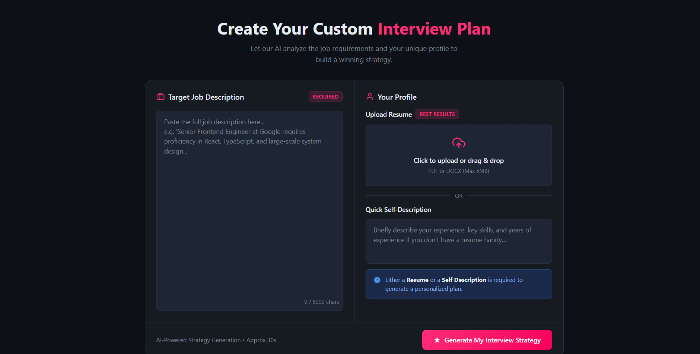
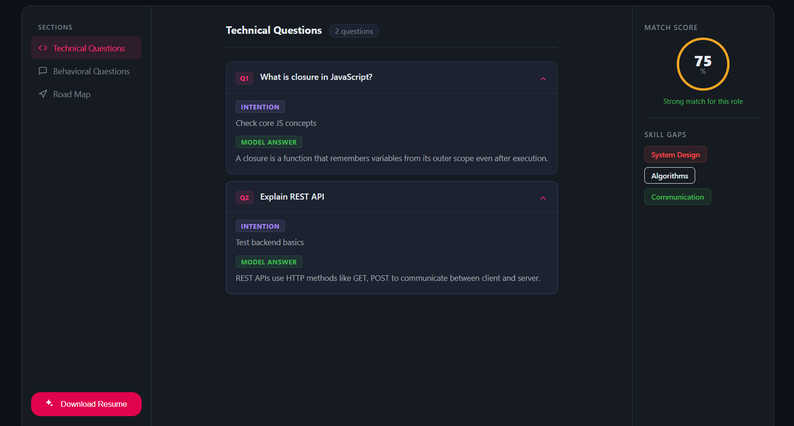
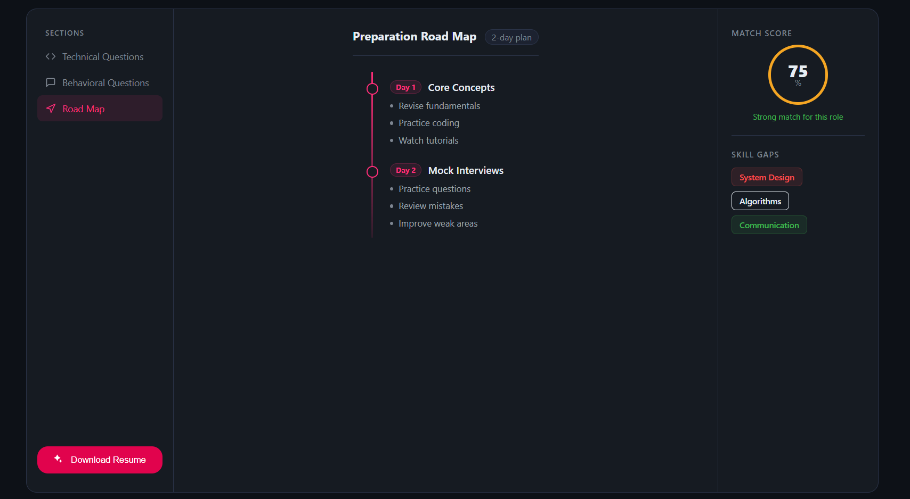

# Resume Interview Prep

A full-stack interview preparation application that combines a React/Vite frontend with an Express/MongoDB backend. The project helps users generate personalized interview reports, technical and behavioral question guidance, preparation roadmaps, and downloadable resume output.

## Overview

This project is built as a two-part web application:

- **Frontend**: React with Vite, providing a polished user interface for login, report creation, review, and resume download.
- **Backend**: Node.js with Express, MongoDB, user authentication, file upload handling, AI-driven interview report generation, and resume PDF generation.

The application is designed for users who want a guided interview strategy based on a job description, their profile, and a resume or self-description.

## Key features

- User registration and login
- Secure authentication with JWT
- Resume upload and file handling
- Dynamic interview report generation
- Technical and behavioral question recommendations
- Preparation roadmap output
- Downloadable resume PDF generation
- MongoDB persistence for user reports

## Setup

### Prerequisites

- Node.js 18 or later
- npm
- MongoDB connection string
- Google GenAI API key

### Backend setup

1. Open a terminal and go to the backend folder:

   ```bash
   cd Backend
   ```

2. Install dependencies:

   ```bash
   npm install
   ```

3. Create a `.env` file inside `Backend` with the following variables:

   ```env
   MONGO_URI=your_mongodb_connection_string
   JWT_SECRET=your_jwt_secret
   GOOGLE_GENAI_API_KEY=your_google_genai_api_key
   ```

4. Start the backend server:

   ```bash
   npm run dev
   ```

The backend listens on `http://localhost:3000` by default.

### Frontend setup

1. Open a separate terminal and go to the frontend folder:

   ```bash
   cd Frontend
   ```

2. Install frontend dependencies:

   ```bash
   npm install
   ```

3. Start the frontend development server:

   ```bash
   npm run dev
   ```

The frontend runs at `http://localhost:5173`.

## Environment variables

The backend requires the following environment variables:

- `MONGO_URI`: MongoDB connection string
- `JWT_SECRET`: Secret used to sign JWT tokens
- `GOOGLE_GENAI_API_KEY`: API key for Google GenAI services

Do not commit `.env` to source control.

## Running the application

1. Start the backend from `Backend`.
2. Start the frontend from `Frontend`.
3. Open the frontend in the browser at `http://localhost:5173`.
4. Register a new user, sign in, upload a resume or enter a self-description, and generate an interview report.

## Screenshots

### Home page



### Technical questions



### Preparation roadmap



## Folder structure

- `Backend/` - server, routes, controllers, middleware, models, and services
- `Frontend/` - React app, pages, hooks, context, and styles
- `working/` - project screenshots used for documentation

## Notes

- Ensure the frontend and backend servers are running simultaneously.
- The backend expects authenticated requests for interview report routes.
- If the AI report generation fails, the frontend includes a fallback report for demonstration.
